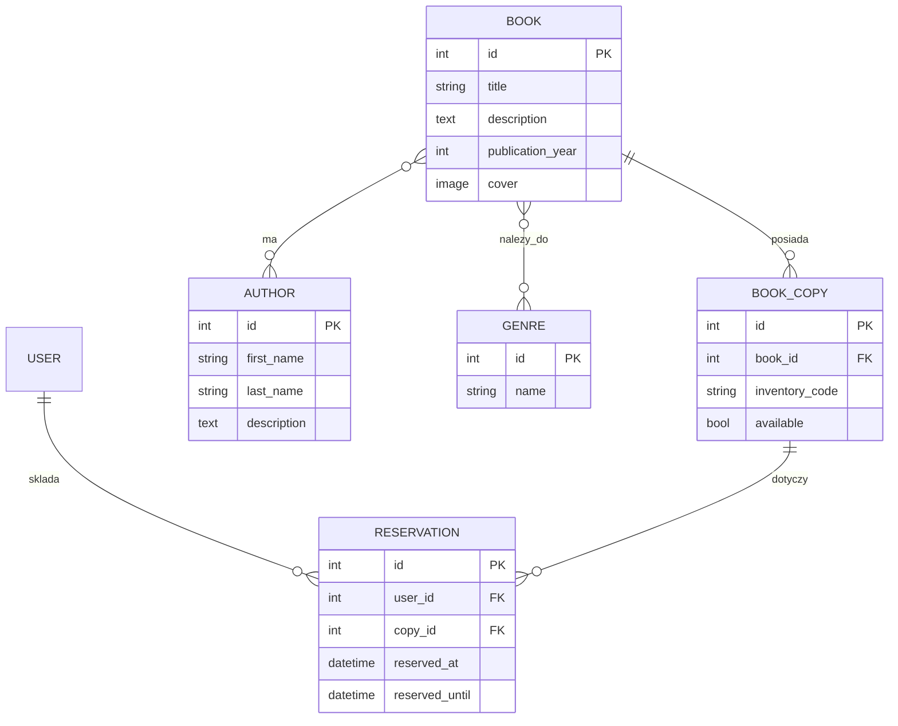

# BiblioTech — finalny plan projektu Lesson28

## 1. Wizja i kontekst

### 1.1. Wizja

BiblioTech jest niewielką aplikacją biblioteczną w Django, która łączy katalog książek z obsługą fizycznych egzemplarzy i prostym procesem rezerwacji.

System ma pozwolić użytkownikowi znaleźć interesującą książkę, sprawdzić jej dostępność i zarezerwować konkretny wolny egzemplarz na 14 dni. Administrator zarządza katalogiem przez Django Admin.

Projekt jest świadomie ograniczony do skali zadania „na jeden weekend”. Ma pokazać kompletny przepływ od problemu i modelu danych do działającej logiki, interfejsu, transakcji, danych demonstracyjnych i testów, bez rozbudowywania aplikacji w pełny system biblioteczny.

### 1.2. Kontekst

W katalogu bibliotecznym sama informacja o książce nie wystarcza. Ten sam tytuł może mieć kilku autorów, należeć do kilku gatunków i występować w kilku fizycznych egzemplarzach. Rezerwacja nie dotyczy więc abstrakcyjnej książki, lecz konkretnego egzemplarza.

BiblioTech porządkuje te zależności i zapewnia jednoznaczną odpowiedź na podstawowe pytania:

- jakie książki znajdują się w katalogu;
- kto jest ich autorem;
- do jakich gatunków należą;
- ile egzemplarzy danej książki istnieje;
- które egzemplarze są dostępne;
- kto i do kiedy zarezerwował konkretny egzemplarz.

---

## 2. Problemy, cele i priorytety

### 2.1. Problemy

- brak rozróżnienia między tytułem książki a fizycznym egzemplarzem;
- trudność w szybkim znalezieniu książki po tytule, autorze lub gatunku;
- ryzyko zarezerwowania tego samego egzemplarza przez dwóch użytkowników;
- potrzeba rozdzielenia aktualnych i historycznych rezerwacji;
- potrzeba wygodnego zarządzania katalogiem bez budowania osobnego panelu administracyjnego.

### 2.2. Cele

- stworzenie czytelnego katalogu książek;
- odwzorowanie relacji książek z wieloma autorami i gatunkami;
- przechowywanie osobnych fizycznych egzemplarzy;
- umożliwienie rezerwacji dostępnego egzemplarza na 14 dni;
- zabezpieczenie rezerwacji przed konfliktem współbieżnych żądań;
- udostępnienie użytkownikowi historii własnych rezerwacji;
- wykorzystanie Django Admin do zarządzania katalogiem;
- przygotowanie sensownych danych demonstracyjnych i podstawowych testów.

### 2.3. Priorytety

1. Poprawność modelu danych.
2. Poprawność rezerwacji i ochrona przed podwójnym zajęciem egzemplarza.
3. Czytelny katalog i filtrowanie.
4. Prosta obsługa użytkownika i administratora.
5. Testowalność.
6. Estetyka wystarczająca do wygodnego używania aplikacji.

Funkcja trafia do projektu tylko wtedy, gdy wspiera podstawowy przepływ biblioteczny albo wynika z przyjętych wymagań.

---

## 3. Role i podstawowe pojęcia

### 3.1. Gość

Użytkownik niezalogowany może:

- przeglądać katalog;
- wyszukiwać książki po tytule lub autorze;
- filtrować po gatunku i dostępności;
- otwierać szczegóły książki;
- zobaczyć autorów, gatunki i liczbę dostępnych egzemplarzy;
- przejść do rejestracji lub logowania.

Nie może tworzyć rezerwacji ani otwierać panelu użytkownika.

### 3.2. Zalogowany użytkownik

Ma wszystkie możliwości gościa oraz:

- może zarezerwować dostępny egzemplarz;
- widzi termin zakończenia rezerwacji;
- przegląda własne aktualne rezerwacje;
- przegląda własną historię rezerwacji.

### 3.3. Administrator

Administrator korzysta ze standardowego Django Admin. Zarządza:

- autorami;
- gatunkami;
- książkami;
- egzemplarzami;
- rezerwacjami.

Nie powstaje drugi, własny panel administracyjny.

### 3.4. Książka i egzemplarz

`Book` opisuje tytuł jako pozycję katalogową. `BookCopy` reprezentuje konkretną fizyczną kopię tej książki.

Jedna książka może mieć wiele egzemplarzy, ale każdy egzemplarz jest przypisany do dokładnie jednej książki.

### 3.5. Rezerwacja

Rezerwacja łączy użytkownika z konkretnym egzemplarzem i obowiązuje przez 14 dni od momentu utworzenia.

---

## 4. Zasady działania

### 4.1. Katalog

- książka może mieć wielu autorów;
- autor może być przypisany do wielu książek;
- książka może należeć do wielu gatunków;
- gatunek może obejmować wiele książek;
- książka może posiadać dowolną liczbę egzemplarzy;
- okładka jest opcjonalna i obsługiwana przez `ImageField` oraz MEDIA.

### 4.2. Wyszukiwanie i filtrowanie

Katalog umożliwia:

- wyszukiwanie tekstowe po tytule;
- wyszukiwanie po imieniu lub nazwisku autora;
- filtrowanie po gatunku;
- ograniczenie wyników do książek posiadających dostępny egzemplarz.

Filtry można łączyć. Przy zapytaniach przechodzących przez relacje ManyToMany stosowane jest `distinct()`, aby jedna książka nie pojawiała się wielokrotnie.

### 4.3. Rezerwacja egzemplarza

1. Użytkownik otwiera szczegóły książki.
2. System pokazuje dostępne egzemplarze.
3. Zalogowany użytkownik wybiera egzemplarz do rezerwacji.
4. Backend rozpoczyna transakcję.
5. Rekord użytkownika jest pobierany z blokadą `select_for_update()`, aby równoległe żądania nie mogły ominąć limitu aktywnych rezerwacji.
6. Wybrany egzemplarz jest pobierany z blokadą `select_for_update()`, aby nie mógł zostać jednocześnie zarezerwowany przez dwóch użytkowników.
7. System sprawdza, czy użytkownik nie ma już aktywnej rezerwacji tej książki oraz czy nie osiągnął limitu 5 aktywnych rezerwacji.
8. System ponownie sprawdza dostępność egzemplarza.
9. Jeżeli wszystkie warunki są spełnione, tworzona jest rezerwacja.
10. Termin końcowy zostaje utworzony na 14 dni od utworzenia.
11. Egzemplarz zostaje oznaczony jako niedostępny.
12. Cała operacja zostaje zatwierdzona razem.

Jeżeli użytkownik ma już aktywną rezerwację tej książki, osiągnął limit 5 aktywnych rezerwacji albo inny użytkownik zdążył wcześniej zarezerwować wybrany egzemplarz, nowa rezerwacja nie zostaje utworzona, a użytkownik otrzymuje czytelny komunikat.

### 4.4. Aktualne i historyczne rezerwacje

Rezerwacja jest aktualna, gdy jej `reserved_until` jeszcze nie minęła. Po upływie terminu jest prezentowana w historii użytkownika.

Historyczne rekordy pozostają w bazie; projekt nie dodaje osobnego mechanizmu archiwizacji ani audytu.

---

## 5. Rozstrzygnięcia projektowe

| Pytanie | Decyzja |
| --- | --- |
| Czy rezerwujemy książkę czy egzemplarz? | Egzemplarz. Dostępność dotyczy fizycznej kopii, nie samego tytułu. |
| Jeden autor czy wielu? | `Book ↔ Author` = ManyToMany. |
| Jeden gatunek czy wiele? | `Book ↔ Genre` = ManyToMany. |
| Jak długo trwa rezerwacja? | 14 dni od utworzenia. |
| Czy gość może rezerwować? | Nie. Rezerwacja wymaga zalogowania. |
| Czy użytkownik może zarezerwować kilka egzemplarzy tej samej książki? | Nie. Jedna aktywna rezerwacja danego tytułu na użytkownika. |
| Ile aktywnych rezerwacji może mieć użytkownik? | Maksymalnie 5. |
| Jak unikamy dwóch rezerwacji tego samego egzemplarza? | `transaction.atomic()` + `select_for_update()` i ponowne sprawdzenie dostępności wewnątrz transakcji. |
| Czy budujemy własny panel administratora? | Nie. Wystarcza odpowiednio skonfigurowany Django Admin. |
| Czy potrzebujemy rozbudowanego REST API? | Nie. Powstaje tylko kilka podstawowych endpointów JSON. |
| Czy potrzebujemy osobnej aplikacji do rezerwacji? | Nie. Przy tej skali jedna aplikacja `library` pozostaje czytelna. |
| Czy potrzebujemy Redis, Celery lub WebSocketów? | Nie. Żaden podstawowy przypadek użycia ich nie wymaga. |
| Czy potrzebujemy SMTP i resetu hasła? | Nie w zakresie tego projektu. |
| Czy potrzebujemy JWT? | Nie. Interfejs korzysta ze standardowego uwierzytelniania sesyjnego Django. |
| Czy potrzebujemy paginacji? | Nie przy zakładanej demonstracyjnej skali projektu. Można ją dodać dopiero przy realnie większym katalogu. |
| Czy potrzebujemy audit trailu? | Nie. Historia rezerwacji wystarcza dla zaprojektowanego zakresu. |

---

## 6. User stories

### 6.1. Gość

- Jako gość chcę przeglądać katalog, aby zobaczyć dostępne książki.
- Jako gość chcę wyszukać książkę po tytule lub autorze, aby szybciej znaleźć interesującą pozycję.
- Jako gość chcę filtrować książki po gatunku, aby zawęzić katalog.
- Jako gość chcę ograniczyć wyniki do książek z dostępnym egzemplarzem.
- Jako gość chcę otworzyć szczegóły książki, aby poznać autorów, gatunki, opis i dostępność.
- Jako gość chcę utworzyć konto lub się zalogować, aby móc rezerwować egzemplarze.

### 6.2. Zalogowany użytkownik

- Jako użytkownik chcę zarezerwować wolny egzemplarz, aby był przypisany do mnie przez 14 dni.
- Jako użytkownik chcę otrzymać czytelny komunikat, gdy egzemplarz nie jest już dostępny.
- Jako użytkownik chcę zobaczyć aktualne rezerwacje i ich terminy.
- Jako użytkownik chcę zobaczyć historię własnych rezerwacji.
- Jako użytkownik chcę, aby system nie pozwalał mi zarezerwować kilku egzemplarzy tej samej książki.
- Jako użytkownik mogę mieć maksymalnie 5 aktywnych rezerwacji jednocześnie.

### 6.3. Administrator

- Jako administrator chcę dodawać i edytować autorów, gatunki i książki.
- Jako administrator chcę zarządzać egzemplarzami bezpośrednio przy książce.
- Jako administrator chcę wyszukiwać i filtrować dane w Django Admin.
- Jako administrator chcę przeglądać rezerwacje użytkowników.

### 6.4. System

- Jako system chcę blokować egzemplarz podczas tworzenia rezerwacji, aby dwa równoległe żądania nie zajęły tej samej kopii.
- Jako system chcę automatycznie wyliczać termin zwrotu egzemplarza.
- Jako system chcę odrzucać próbę rezerwacji niedostępnego egzemplarza.
- Jako system chcę blokować drugą aktywną rezerwację tej samej książki przez tego samego użytkownika.
- Jako system chcę egzekwować limit 5 aktywnych rezerwacji na użytkownika.
- Jako system chcę zachować historyczne rezerwacje użytkownika.

---

## 7. Widoki i przepływy

### 7.1. Katalog `/`

Strona główna zawiera:

- pole wyszukiwania po tytule lub autorze;
- filtr gatunku;
- filtr dostępności;
- przycisk wyszukiwania;
- listę lub siatkę książek;
- liczbę dostępnych egzemplarzy przy książce.

Filtry tworzą jeden spójny rząd na większym ekranie i dostosowują układ na mniejszych urządzeniach.

### 7.2. Szczegóły książki `/books/<id>/`

Widok pokazuje:

- tytuł;
- autora bądź autorów;
- gatunki;
- rok wydania;
- opis;
- opcjonalną okładkę;
- egzemplarze;
- informację o dostępności.

Zalogowany użytkownik może z tego miejsca zarezerwować wolny egzemplarz.

### 7.3. Rejestracja `/register/`

Formularz korzysta z `UserCreationForm`, ale otrzymuje czytelne polskie etykiety i krótkie opisy pól. Widok pozostaje prosty i wizualnie spójny z resztą aplikacji.

### 7.4. Logowanie i wylogowanie

Standardowe widoki Django auth:

```text
/accounts/login/
/accounts/logout/
```

### 7.5. Moje rezerwacje `/my-reservations/`

Panel użytkownika dzieli rekordy na:

- aktualne rezerwacje;
- historyczne rezerwacje.

Użytkownik widzi wyłącznie własne rekordy.

### 7.6. Rezerwacja `/reserve/<copy_id>/`

Żądanie `POST` uruchamia serwis rezerwacji. Widok nie implementuje samodzielnie logiki współbieżności.

---

## 8. Zakres projektu

### 8.1. Funkcje należące do finalnej wersji

- modele `Author`, `Genre`, `Book`, `BookCopy`, `Reservation` oraz Django `User`;
- relacje ManyToMany książka–autor i książka–gatunek;
- migracje;
- skonfigurowany Django Admin;
- obsługa okładek przez MEDIA;
- katalog;
- wyszukiwanie po tytule i autorze;
- filtrowanie po gatunku;
- filtrowanie po dostępności;
- szczegóły książki;
- rejestracja;
- logowanie i wylogowanie;
- transakcyjna rezerwacja konkretnego egzemplarza na 14 dni;
- panel aktualnych i historycznych rezerwacji;
- kilka podstawowych endpointów JSON;
- `seed_db` z Fakerem;
- testy najważniejszych zachowań;
- prosty responsywny frontend.

### 8.2. Świadomie pominięte elementy

Projekt nie obejmuje:

- przedłużania i anulowania rezerwacji;
- pełnego procesu wypożyczania i zwrotów;
- kolejek oczekujących na niedostępne egzemplarze;
- naliczania kar za przetrzymanie książki;
- powiadomień o zbliżającym się terminie zwrotu;
- raportów, np. zestawienia rezerwacji do PDF;
- rozbudowanej historii operacji;
- rozbudowanego API wykraczającego poza podstawowe endpointy.

Elementy te mogą być naturalnym rozwinięciem systemu bibliotecznego, ale nie są potrzebne
do realizacji jego podstawowego zakresu.

---

## 9. Model danych

### 9.1. `User`

Wbudowany model Django odpowiedzialny za konto i uwierzytelnienie.

### 9.2. `Author`

- `first_name`;
- `last_name`;
- `description` — opcjonalny.

### 9.3. `Genre`

- `nazwa` — unikalna.

### 9.4. `Book`

- `title`;
- `authors` — ManyToMany do `Author`;
- `genres` — ManyToMany do `Genre`;
- `description`;
- `publication_year`;
- `cover` — opcjonalny `ImageField`.

### 9.5. `BookCopy`

- `book` — ForeignKey;
- `inventory_code` — unikalna;
- `available` — `BooleanField`.

### 9.6. `Reservation`

- `user` — ForeignKey do `User`;
- `copy` — ForeignKey;
- `reserved_at`;
- `reserved_until`.

`reserved_until` jest wyliczana przy tworzeniu rezerwacji jako termin 14 dni od początku.

---

## 10. ERD



Najważniejsze relacje:

| Relacja | Kardynalność |
| --- | --- |
| `Book` — `Author` | M:N |
| `Book` — `Genre` | M:N |
| `Book` — `BookCopy` | 1:N |
| `User` — `Reservation` | 1:N |
| `BookCopy` — `Reservation` | 1:N historycznie |

---

## 11. Logika rezerwacji i transakcje

Logika tworzenia rezerwacji znajduje się w `library/services/reservations.py`, a nie bezpośrednio w widoku.

Podstawowy przepływ:

```text
POST rezerwacji
→ sprawdzenie użytkownika
→ transaction.atomic()
→ select_for_update() egzemplarza
→ sprawdzenie, czy użytkownik nie ma już aktywnej rezerwacji tej książki
→ sprawdzenie limitu 5 aktywnych rezerwacji
→ ponowne sprawdzenie dostępności
→ wyliczenie terminu +14 dni
→ utworzenie `Reservation`
→ ustawienie available=False
→ commit
```

Transakcja jest uzasadniona wymaganiem domenowym. Nie jest dodatkową technologią „dla efektu”: chroni dokładnie ten przypadek, w którym dwóch użytkowników próbuje zarezerwować ten sam egzemplarz.

Jeżeli operacja się nie powiedzie, baza powinna pozostać w takim stanie jak przed próbą rezerwacji.

---

## 12. API

API jest celowo niewielkie:

```text
GET /api/books/
GET /api/books/<id>/
GET /api/my-reservations/
```

Endpointy pokazują podstawową możliwość udostępnienia danych aplikacji bez budowania pełnego REST API całego systemu.

Do tak małego zakresu nie jest potrzebne dokładanie osobnej architektury API, JWT ani SPA.

---

## 13. Django Admin

### 13.1. `Author`

- `list_display`: `last_name`, `first_name`;
- `search_fields`: `first_name`, `last_name`.

### 13.2. `Genre`

- nazwa na liście;
- wyszukiwanie po nazwie.

### 13.3. `Book`

- `list_display`: `title`, `publication_year`;
- `search_fields`: `title`, `authors__first_name`, `authors__last_name`;
- `list_filter`: `genres`;
- egzemplarze jako inline.

### 13.4. `BookCopy`

- `list_display`: `inventory_code`, `book`, `available`;
- wyszukiwanie po sygnaturze i tytule;
- filtrowanie po dostępności.

### 13.5. `Reservation`

- użytkownik;
- egzemplarz;
- początek;
- koniec;
- wyszukiwanie po użytkowniku, tytule i sygnaturze;
- filtrowanie po dacie.

Django Admin ma być użyteczny, ale nie zastępuje interfejsu użytkownika.

---

## 14. Dane demonstracyjne

Dane tworzy jawnie uruchamiana komenda:

```bash
python manage.py seed_db
```

Do przygotowania przykładowego katalogu wykorzystywane są Faker oraz kontrolowane mechanizmy losowania. Dane demonstracyjne obejmują:

- autorów;
- książki wraz z opisami;
- gatunki;
- relacje ManyToMany;
- egzemplarze;
- przykładowego użytkownika.

Tytuł powstaje zgodnie z głównym gatunkiem książki, z wykorzystaniem prostych schematów językowych i kontrolowanych zbiorów wyrażeń. Przy dwóch gatunkach wybierane są tylko sensowne połączenia, a pierwszy z nich wyznacza główny charakter książki. Opisy są budowane z krótkich, naturalnych zdań dopasowanych do tego charakteru zamiast z niekontrolowanego `fake.text()`.

Część książek otrzymuje również demonstracyjne okładki. Zdjęcie jest dobierane na podstawie konkretnego motywu wynikającego z tytułu oraz charakteru głównego gatunku, dzięki czemu nie jest ani przypadkowo „gatunkowe”, ani zbyt dosłowne. Przy kilku gatunkach główny gatunek wpływa na dobór zdjęcia, a wszystkie przypisane gatunki są prezentowane wspólnie na okładce. Okładka zawiera także autora lub autorów książki oraz dyskretne oznaczenie BiblioTech jako wydania demonstracyjnego. Brak dostępu do sieci nie blokuje tworzenia danych; w takim przypadku książka pozostaje bez okładki.

Mechanizm nie uruchamia się jako efekt uboczny importu. Dane powstają dopiero po jawnym wykonaniu management command.

---

## 15. Frontend

Frontend pozostaje prosty i estetyczny:

- wspólny layout;
- czytelna nawigacja;
- responsywny katalog z miejscem na opcjonalną okładkę po lewej stronie karty;
- spójne kontrolki filtrów;
- karta rejestracji;
- komunikaty Django messages;
- czytelne stany dostępności;
- tytuły i opisy bez pozostawiania krótkich polskich przyimków i spójników na końcu wiersza;
- formularze bez rozbudowanego design systemu.

Celem CSS jest wygodne używanie aplikacji, a nie stworzenie osobnego projektu frontendowego.

---

## 16. Strategia testów

Testy dotyczą przede wszystkim własnego zachowania aplikacji, a nie funkcji, które Django zapewnia bez dodatkowej logiki.

### 16.1. Modele i relacje

- utworzenie autora, gatunku, książki i egzemplarza;
- relacja książki z wieloma autorami;
- relacja książki z wieloma gatunkami;
- unikalność sygnatury egzemplarza.

### 16.2. Widoki

- katalog dostępny anonimowo;
- szczegóły książki;
- filtrowanie po gatunku;
- wyszukiwanie;
- panel rezerwacji niedostępny anonimowo;
- podstawowe odpowiedzi endpointów API.

### 16.3. Rezerwacja

- poprawna rezerwacja dostępnego egzemplarza;
- termin ustawiony na 14 dni;
- zmiana `available` na `False`;
- odmowa rezerwacji niedostępnego egzemplarza;
- odmowa rezerwacji drugiego egzemplarza tej samej książki przez tego samego użytkownika;
- odmowa utworzenia szóstej aktywnej rezerwacji;
- brak częściowej zmiany danych po nieudanej operacji.

### 16.4. Współbieżność

Kod wykorzystuje `transaction.atomic()` i `select_for_update()`.

Pełny test rzeczywistej blokady wiersza powinien być wykonywany na bazie, która obsługuje takie blokady zgodnie z założeniami produkcyjnymi. SQLite używany lokalnie nie odwzorowuje wszystkich zachowań współbieżności PostgreSQL.

### 16.5. Uruchamianie

```bash
python manage.py test --verbosity 2
```

`--verbosity 2` pokazuje nazwy i wyniki poszczególnych testów mimo uruchomienia całego zestawu jednym poleceniem.

---

## 17. Organizacja kodu

Struktura projektu w repozytorium:

```text
lesson28/
├── bibliotech/
│   ├── bibliotech/
│   │   ├── __init__.py
│   │   ├── asgi.py
│   │   ├── settings.py
│   │   ├── urls.py
│   │   └── wsgi.py
│   ├── library/
│   │   ├── management/
│   │   │   ├── __init__.py
│   │   │   └── commands/
│   │   │       ├── __init__.py
│   │   │       └── seed_db.py
│   │   ├── migrations/
│   │   │   ├── __init__.py
│   │   │   └── 0001_initial.py
│   │   ├── services/
│   │   │   ├── __init__.py
│   │   │   └── reservation_service.py
│   │   ├── static/
│   │   │   └── library/
│   │   │       ├── cover_sources/
│   │   │       │   └── ...
│   │   │       └── style.css
│   │   ├── templates/
│   │   │   ├── base.html
│   │   │   ├── book_detail.html
│   │   │   ├── catalog.html
│   │   │   ├── login.html
│   │   │   ├── my_reservations.html
│   │   │   └── register.html
│   │   ├── templatetags/
│   │   │   ├── __init__.py
│   │   │   └── polish_typography.py
│   │   ├── tests/
│   │   │   ├── __init__.py
│   │   │   ├── test_cover_generation.py
│   │   │   ├── test_reservation_service.py
│   │   │   ├── test_typography.py
│   │   │   └── test_views.py
│   │   ├── __init__.py
│   │   ├── admin.py
│   │   ├── apps.py
│   │   ├── forms.py
│   │   ├── models.py
│   │   ├── urls.py
│   │   └── views.py
│   ├── manage.py
│   ├── README.md
│   └── requirements.txt
└── docs/
    └── PROJECT_PLAN.md
```

Projekt pozostaje mały i korzysta z jednej aplikacji domenowej `library`. Osobny katalog `services` wydziela logikę rezerwacji, `management/commands` zawiera jawnie uruchamiany seeder, a testy są rozbite na osobne moduły zamiast pozostawać w pojedynczym `tests.py`.

Lokalne pliki środowiska i dane robocze, takie jak `db.sqlite3`, `.venv` oraz `__pycache__`, nie należą do struktury repozytorium i nie są uwzględniane w planie.

### 17.1. Typowanie i dokumentacja

- type hints stosujemy przede wszystkim dla parametrów funkcji i wartości zwracanych;
- docstringi dodajemy tylko tam, gdzie wyjaśniają nieoczywistą logikę lub odpowiedzialność;
- proste funkcje i metody nie otrzymują docstringów powtarzających ich nazwę;
- komentarze opisują powód nietypowego rozwiązania, a nie kolejne oczywiste instrukcje;
- nazewnictwo pozostaje spójne z językiem domeny projektu.


---

## 18. Kolejność realizacji

1. Konfiguracja projektu i aplikacji.
2. Modele.
3. Migracje.
4. ERD i weryfikacja relacji.
5. Django Admin.
6. MEDIA.
7. Katalog.
8. Wyszukiwanie i filtry.
9. Szczegóły książki.
10. Rejestracja, logowanie i wylogowanie.
11. Serwis rezerwacji z transakcją.
12. Panel aktualnych i historycznych rezerwacji.
13. Podstawowe API.
14. Generowanie przykładowych danych przez `seed_db`.
15. Testy.
16. Końcowa weryfikacja interfejsu i scenariuszy.

Każdy etap ma prowadzić do działającej części projektu, zamiast tworzyć infrastrukturę dla funkcji, których aplikacja nie potrzebuje.

---

## 19. Kryteria ukończenia

Projekt jest gotowy, gdy:

- [x] istnieją modele i migracje;
- [x] `Book ↔ Author` jest relacją ManyToMany;
- [x] `Book ↔ Genre` jest relacją ManyToMany;
- [x] istnieje rozróżnienie książki i egzemplarza;
- [x] Django Admin jest skonfigurowany;
- [x] MEDIA obsługuje okładki;
- [x] katalog działa;
- [x] wyszukiwanie i filtry działają;
- [x] szczegóły książki działają;
- [x] rejestracja i logowanie działają;
- [x] użytkownik może zarezerwować dostępny egzemplarz;
- [x] użytkownik może mieć tylko jeden aktywny egzemplarz danej książki;
- [x] użytkownik może mieć maksymalnie 5 aktywnych rezerwacji;
- [x] rezerwacja trwa 14 dni;
- [x] operacja korzysta z `transaction.atomic()` i `select_for_update()`;
- [x] użytkownik widzi aktualne i historyczne rezerwacje;
- [x] istnieje podstawowe API;
- [x] `seed_db` generuje dane demonstracyjne;
- [x] istnieją podstawowe testy;
- [x] frontend jest czytelny i responsywny;
- [x] zakres nie został rozbudowany poza potrzeby Lesson28.

---

## 20. Możliwe rozszerzenia

Dopiero po ukończeniu podstawowego projektu można rozważyć:

- paginację większego katalogu;
- anulowanie rezerwacji;
- pełny proces wypożyczenia i zwrotu;
- terminy zwrotu i kary;
- powiadomienia;
- bardziej rozbudowane API;
- dodatkowe role biblioteczne;
- raporty i statystyki.

Nie są one częścią finalnego zakresu BiblioTech i nie powinny blokować oddania projektu.
